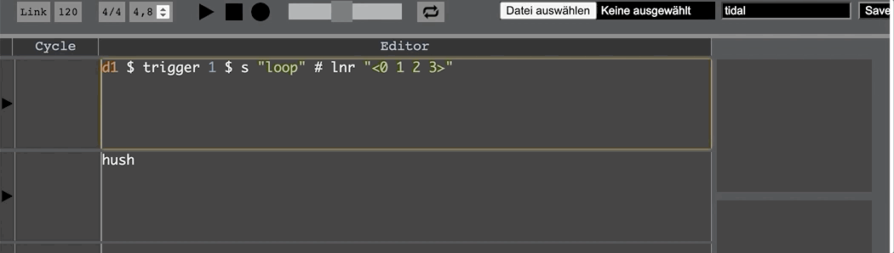

# Looper with osc feedback messages

To display the recording status, osc messages are sent via SuperCollider. This folder contains an example for Hydra and an example for CycSeq.

You may want to add the line ``s.options.protocol_(\tcp);`` to your ``startup.scd`` file in SuperCollider inside  ``s.reboot`` to make sure that the OSC feedback messages arrive in the correct order.

The usage of the looper can be found on the landing page of this project under [tidal-looper](https://github.com/thgrund/tidal-looper)

## Hydra Example

Hydra is a set of tools for livecoding networked visuals. There are plugins for Atom and VSCode. But you can also run it locally on your browser.

In the file ``hydra-example-looper.scd`` two types of messages are sent  to different adresses: 

- ``"/hydra/color"`` : Sends and array with three floats (as rgb) values
- ``"/hydra/brightness"``: Sends and float value

The idea is to change the color of a Hydra visual during a recording. By using different colors, different record buffers are indicated.

The default port for exchanging osc messages is `3336`

The result of all this looks like this:

**References:**

- Hydra project page: https://github.com/ojack/hydra
- Atom-Plugin: https://github.com/ojack/atom-hydra
- VSCode Plugin: https://github.com/Jarvl/vscode-hydra

## CycSeq Example

CycSeq represents a graphical sequencer (similar to a step sequencer) for [TidalCycles](http://pages.tidalcycles.org/getting_started.html). With this sequencer it is possible to activate written code automatically.

In the file `cycles-looper.scd` on message with the address `/cycseq/message/looper` is sent. The three arguments are:

1. Buffer name (String)
2. Record status (Boolean)
3. Input number (Integer)

The default port for exchanging osc messages is `57121`

The result looks like this:

**Reference**

- CycSeq project page: https://github.com/thgrund/cycseq
